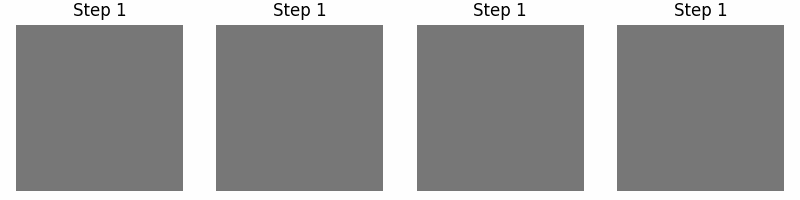
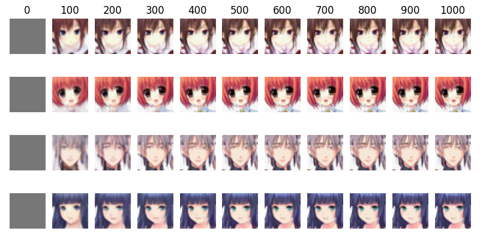
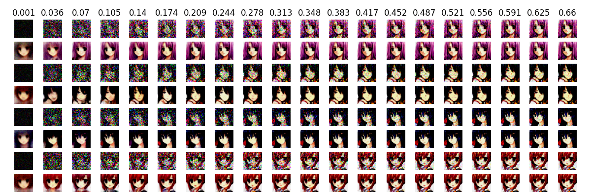

# BFNs-animeface

AnimeFace dataset generation by BFNs [Bayesian Flow Networks](https://arxiv.org/abs/2308.07037)

## Continuous Bayesian Flow Networks

Continuous Infinity Time Loss ( steps=1000 sigma=0.001 )


Discretized Infinity Time Loss ( K=16 steps=1000 sigma=0.03 )



### Infinity Loss
#### Sample Images
Generated Images
(The number above is the number of Steps)


Validated Images
(Upper is parameter μ, lower is Output)


### Sample Train Code
```
python train_continuours.py --save_model_path "./models/model.pth" --epoch 100 --sigma 0.001 --batch 32 --height 32 --width 32
```

### Discrete Loss
#### Sample Images
Generated Images
(The number above is the number of Steps)


Validated Images
(Upper is parameter μ, lower is Output)


### Sample Train Code
```
python train_continuours_discrete_loss.py --save_model_path "./models/model.pth" --epoch 100 --sigma 0.001 --batch 32 --height 32 --width 32 --max_step 1000
```

## Discretized Bayesian Flow Networks

### Infinity Loss
#### Sample Images
Generated Images
(The number above is the number of Steps)


Validated Images
(Upper is parameter μ, lower is Output)


### Sample Train Code
```
python train_discretized.py --save_model_path "./models/model.pth" --epoch 100 --sigma 0.001 --batch 32 --height 32 --width 32 --K 16
```
### Discrete Loss

### Sample Train Code
```
python train_discretized_discrete_loss.py --save_model_path "./models/model.pth" --epoch 100 --sigma 0.001 --batch 32 --height 32 --width 32 --max_step 1000 --K 16 
```

### Other
#### Used Unet
Show Summary
```
python networks/unet.py
```

```txt
===============================================================================================
Total params: 110,876,003
Trainable params: 110,876,003
Non-trainable params: 0
Total mult-adds (G): 99.13
===============================================================================================
Input size (MB): 0.05
Forward/backward pass size (MB): 1555.33
Params size (MB): 443.47
Estimated Total Size (MB): 1998.85
===============================================================================================
```

# Features
- [x] Continuous Bayesian Flow Networks
- - [x] infinity loss
- - [x] discrete loss
- [x] Discretised Bayesian Flow Networks
- - [x] infinity loss
- - [ ] discrete loss ( Help.... Where is the bug? )