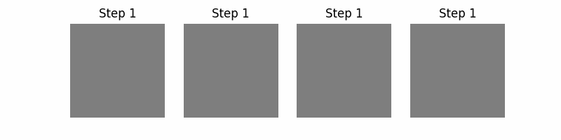
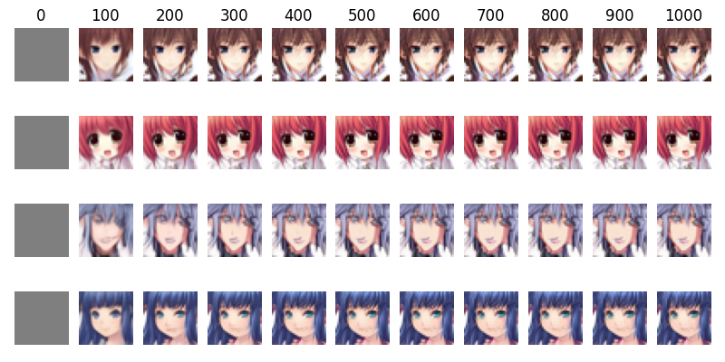
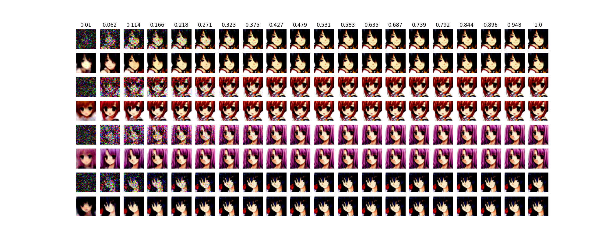
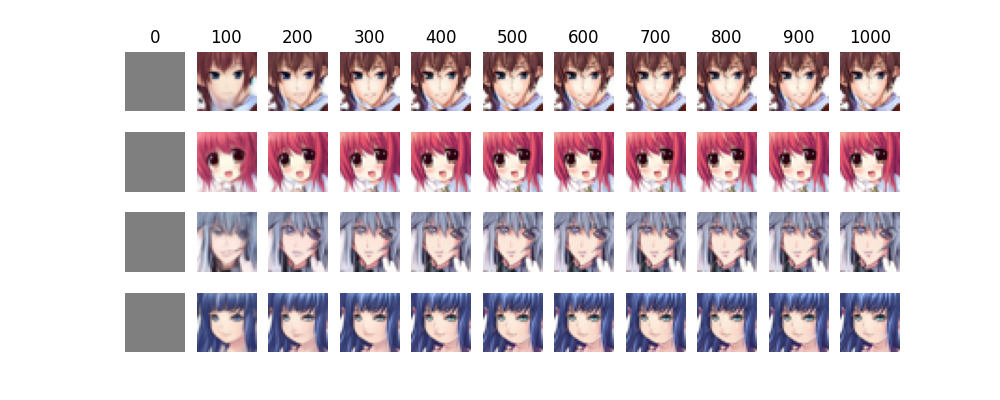
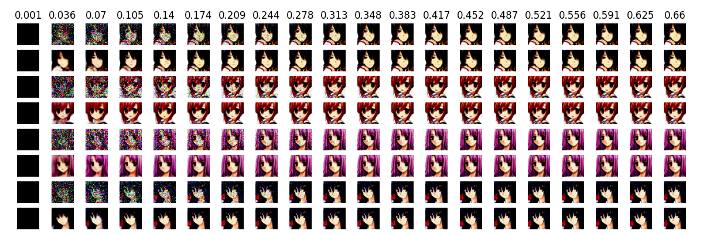

# BFNs-animeface
AnimeFace dataset generation by BFNs

## Continuous Bayesian Flow Networks


### Infinity Loss
#### Sample Images



### Sample Train Code
```
python train_continuours.py --save_model_path "./models/model.pth" --epoch 100 --sigma 0.001 --batch 32 --height 32 --width 32
```

### Discrete Loss
#### Sample Images



### Sample Train Code
```
python train_continuours_discrete_loss.py --save_model_path "./models/model.pth" --epoch 100 --sigma 0.001 --batch 32 --height 32 --width 32 --max_step 1000
```

## Discretized Bayesian Flow Networks

### Infinity Loss

### Sample Train Code
```
python train_discretized.py --save_model_path "./models/model.pth" --epoch 100 --sigma 0.001 --batch 32 --height 32 --width 32 --K 16
```
### Discrete Loss

### Sample Train Code
```
python train_discretized_discrete_loss.py --save_model_path "./models/model.pth" --epoch 100 --sigma 0.001 --batch 32 --height 32 --width 32 --max_step 1000 --K 16 
```
# Features
- [x] Continuous Bayesian Flow Networks
- - [x] infinity loss
- - [x] discrete loss
- [ ] Discretised Bayesian Flow Networks
- - [ ] infinity loss
- - [ ] discrete loss